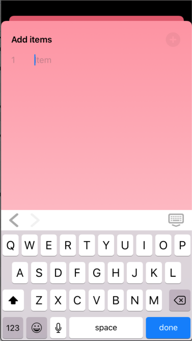

# InputAccessoryTextField

A (almost) drop-in replacement for SwiftUI's TextField, but with a customisable input accessory view.
A significant part of this is based on work by Swift Student - [SwiftUI InputAccessoryView](https://swiftstudent.com/2020-01-15-swiftui-inputaccessoryview/) - but I've removed the need for an accessoryViewController instance in the containing view, and added quite a bit in the way of customisation options for the consumer.



## Installation

### Swift Package Manager

In Xcode:
* File ⭢ Swift Packages ⭢ Add Package Dependency...
* Use the URL https://github.com/franklynw/InputAccessoryTextField.git


## Example

> **NB:** All examples require `import InputAccessoryTextField` at the top of the source file

The only additional requirement for using an InputAccessoryTextField instead of a TextField is that the containing view conforms to Identifiable, with a String id.

```swift
var body: some View {

    InputAccessoryTextField(parentView: self, tag: 1, placeholder: "Enter search text", text: viewModel.searchTerm)
        .returnKeyType(.done)
        .foregroundColor(Color(viewModel.titleColor))
        .disableAutocorrection(!viewModel.autocorrect)
        .autocapitalization(viewModel.itemCapitalizationPolicy)
        .startInput()
}
```

To use with the "previous" and "next" buttons on the accessory view, each textField in the view needs to have a unique tag. Pressing "next" will show the field with the next-highest tag, pressing "previous" will show the field with the next lowest. If there is only one textField, these buttons will be hidden.

There are some additional features apart from the input accessory view -

### Font

You can set the textField's font using either a UIFont, or with Font.TextStyle & Font.Weight

```swift
InputAccessoryTextField(parentView: self, tag: 1, placeholder: "Enter search text", text: viewModel.searchTerm)
    .font(UIFont.systemFont(ofSize: 18, weight: .semibold))
```

or

```swift
InputAccessoryTextField(parentView: self, tag: 1, placeholder: "Enter search text", text: viewModel.searchTerm)
    .font(.title, weight: .semibold)
```

###  Keyboard Type

You can set the keyboard type -

```swift
InputAccessoryTextField(parentView: self, tag: 1, placeholder: "Enter search text", text: viewModel.searchTerm)
    .keyboardType(.numberPad)
```

### Return Key Type

You can set the return key type -

```swift
InputAccessoryTextField(parentView: self, tag: 1, placeholder: "Enter search text", text: viewModel.searchTerm)
    .returnKeyType(.done)
```

### Autocorrection

Autocorrection can be switched on or off -

```swift
InputAccessoryTextField(parentView: self, tag: 1, placeholder: "Enter search text", text: viewModel.searchTerm)
    .disableAutocorrection(!viewModel.autocorrect)
```

### Autocapitalisation

The autocapitalisation policy can be set -

```swift
InputAccessoryTextField(parentView: self, tag: 1, placeholder: "Enter search text", text: viewModel.searchTerm)
    .autocapitalization(viewModel.autocapitalizationPolicy)
```

### Become first responder

You can make the textField automatically become the first resonder (ie, it brings up the keyboard as soon as it appears) -

```swift
InputAccessoryTextField(parentView: self, tag: 1, placeholder: "Enter search text", text: viewModel.searchTerm)
    .startInput()
```

The modifier can also take a Bool parameter to base its behaviour on another property.

### Customise the "Done" button on the input accessory view

Pass in a system image name to use that for the button. You can also set the action to be invoked when the button is pressed, in addition to it dismissing the keyboard. If no image is specified, it will default to "keyboard.chevron.compact.down"

```swift
InputAccessoryTextField(parentView: self, tag: 1, placeholder: "Enter search text", text: viewModel.searchTerm)
    .done(buttonImage: "rectangle.and.pencil.and.ellipsis") {
        // do something
    }
```

### Standard behaviour

In addition to the above, you can also specify the foregroundColor, which sets the text colour.


## Dependencies

Requires FWCommonProtocols, which is linked. GitHub page is [here](https://github.com/franklynw/FWCommonProtocols)


## License  

`InputAccessoryTextField` is available under the MIT license
